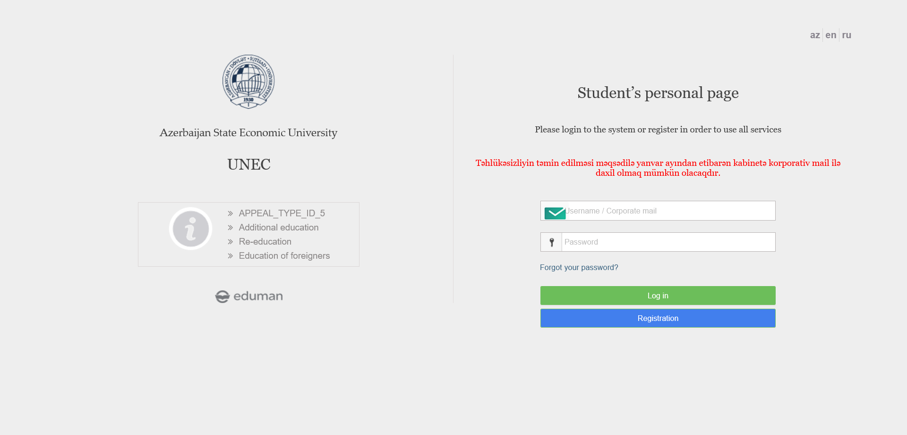
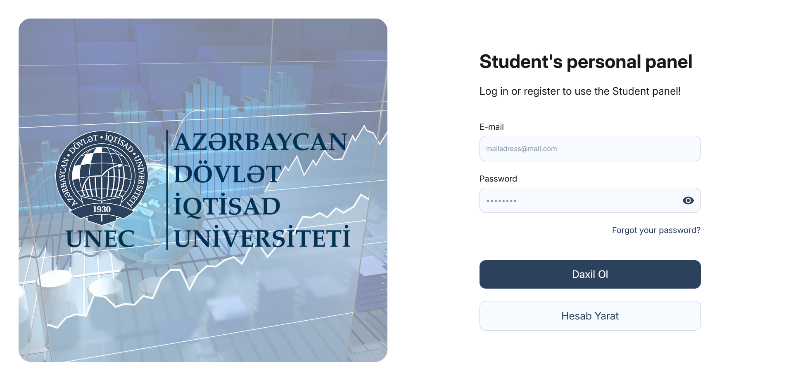

# Project Change Log

This document tracks differences between the old and new versions of the project.  
Each section includes **before & after images** and a list of changes.

---

## Login Page

### Before and After Comparison

<table>
<tr><th>Before</th><th>After</th></tr>
<tr><td></td><td></td></tr>
</table>

### Changes
#### ✅ Added:
- New Banner and Logo
- Visibility Option to Password
- Automatic Transition to Dark Mode (System Preferences)
- Automatic Switching to Language Options (System Preferences) (en, ru, az, tr)
- More Compatible with Tablets and Phones

#### ❌ Removed:
- Informative Subtitles and Videos
- Logo of the Site Builder
- Irrelevant Logo Type
- Language Options
- Unnecessary Notification

#### 🔄 Modified:
- Whole Html Structure
- Font-Family (Inter)
- Header, Input, Placeholder, Button, Link, UI

---

---

## Summary & Closing Remarks

This document serves as a **detailed comparison** between Decrepit and new versions of the UNEC cabinet site.  
For more details about **soruce code**